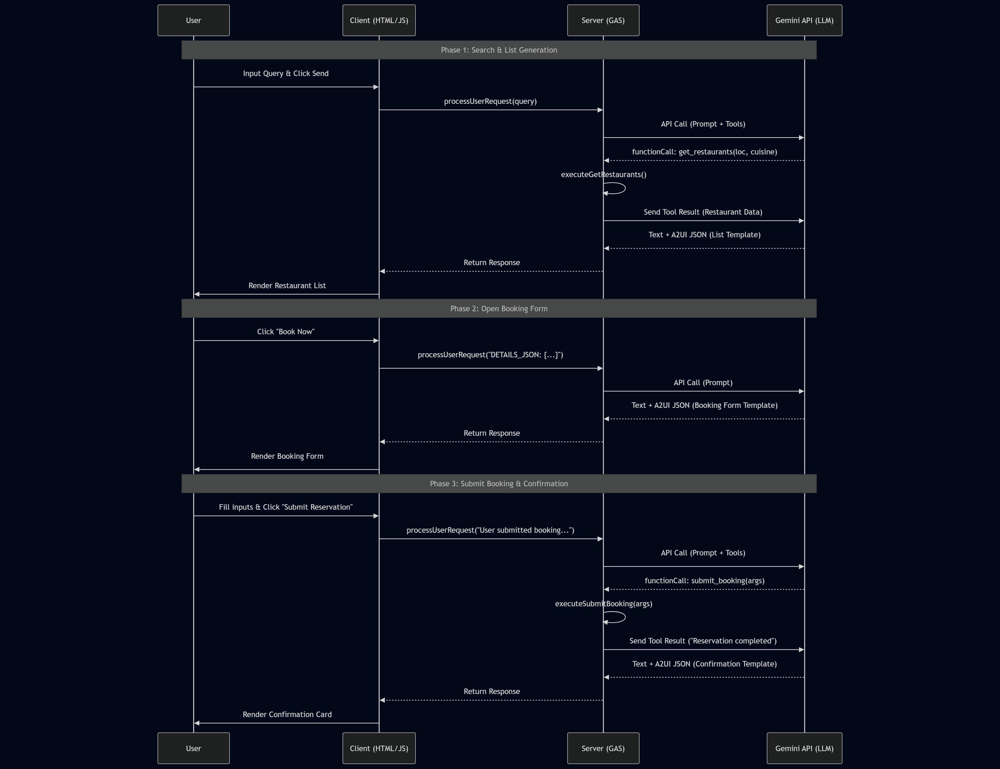

# A2UI for Google Apps Script

# Abstract

This article demonstrates how to implement Google's A2UI (Agent-to-User Interface) using Google Apps Script (GAS). By porting official Python/TypeScript examples to GAS, we show how to create dynamic, AI-generated interfaces within Google Workspace, enabling flexible business automation and interactive user experiences without complex server infrastructure.

# Introduction

Google recently released **A2UI**, a protocol designed for agent-driven interfaces. [Ref](https://developers.googleblog.com/introducing-a2ui-an-open-project-for-agent-driven-interfaces/) A2UI enables AI agents to generate rich, interactive user interfaces that render natively across web, mobile, and desktop environments without executing arbitrary code.

Currently, the server-side and client-side (frontend) components in the official repository are built using Python and TypeScript, respectively. [Ref](https://github.com/google/A2UI) While support for other platforms may arrive in future updates, a sample script for **Google Apps Script (GAS)** has not yet been released.

I believe that enabling A2UI within Google Apps Script offers significant advantages. It allows for seamless integration with Google Workspace, making it highly useful for a broad range of users. Furthermore, GAS allows developers to build both the server and client sides simply using Web Apps. [Ref](https://developers.google.com/apps-script/guides/web) This is a powerful feature of the GAS ecosystem.

In this article, I have implemented the "A2UI Restaurant finder and table reservation agent sample" from the official repository using Google Apps Script. [Ref](https://github.com/google/A2UI/tree/main/samples/agent/adk/restaurant_finder)

Previously, GAS development required manually coding dialogs and sidebar UIs using `HTMLService`. By adopting A2UI, AI can now dynamically generate the optimal buttons and input fields based on the specific context. This enables extremely flexible business automation while significantly reducing development costs.

# Repository

[https://github.com/tanaikech/A2UI-for-Google-Apps-Script](https://github.com/tanaikech/A2UI-for-Google-Apps-Script)

# Workflow

The workflow of this sample script is illustrated below.



[Mermaid Chart Playground](https://mermaidchart.com/play?utm_source=mermaid_live_editor&utm_medium=share#pako:eNqtVV1v2jAU_SuWH6ZMSxmU0oEfKlG6dlT0Y4W-TJGQm1zAamKn_tjoEP991ySw9IONSuUFOznn3HPv9Y0XNFYJUEYNPDiQMZwIPtU8iyTBX861FbHIubTk1oB--bSXCsA_btar4NvoYvD5fPjxJXYI-idojy1XwVn3NdwZZEIKjytX3es-CQaDC8QW6EtlgSgv4V2FJY6R6xk3QBoMA3Adz8gHMhDGC0rQ3ApV0j1p7-iocMxIX-bOku8O9CMy8Gl8jwIyKcAFCuGFaUZyrWIwxovc-KIZGzx4bplJAUP82pR33-NpSoJrrbLckk9kpFRqSnwB26sEmDgZe7OexMgU7FhjEO40FscEqYpDEjthhITnIdcKMIfYWTgDe1NhbjPoc11ZIoh2KfbwL4uccMu3Oh3B3KfT3b_tk_Ph1SV2ydd7BFmecvvMXqXiN2Cdlj5crqSBZ4X2lfUYmWCDK1a89m4nYJ-RqxwkOVbqXsgpOVU6e7X1RbMj6oGo-Suiuzc9oidfR93-YDj2qTOyqNVqy4juegzeUNRqGu9a3Kf12aWyTTwu7i4TdsPFiVFyInS2fcBOBaYt_JSZzYBFtNRBn5hCQX5T9f2OmJWIhYTcFX6wCbv34I2jWAQbl5ECrqfmPxNY5Hj8D8L2IYxopTQkRr8pYKKb7HY5OdXWvOvJeSLc4zqhIZ1qkVBmtYOQZoAv_ZYuvExE7QwyiCjDZcL1vW_1Ejn4wf-hVLamaeWmM8omPDW4c3mCdssbaQNZGegpJy1lnZUCZQs6p6zZaNUO2wedTrvRrNc7jWZIHyk77NTaXw46hwf1erPVbjWay5D-XoWs44tWSCERVumL4hpc3YbLP_J9V2U)

In [the official sample script for A2UI (Restaurant finder)](https://github.com/google/A2UI/tree/d7996656ef2bc0cdffad499452fc5b282d878d45/samples/agent/adk/restaurant_finder), the client communicates with the server via A2A (Agent2Agent) protocols. However, in this article, we optimize the architecture for GAS. To reduce the overhead of HTTP requests associated with A2A communication, the client (HTML) communicates directly with the AI agent built on Google Apps Script using `google.script.run`.

# Usage

To use this application, please follow the steps below.

## 1. API key

You will need a valid Gemini API Key. [Get one here](https://ai.google.dev/gemini-api/docs/api-key).

## 2. Sample script

You can copy the Google Spreadsheet containing the necessary Google Apps Script using the link below.

**[https://docs.google.com/spreadsheets/d/1csYUJO8LzcEFPkt_ickIkdsGZsvim6lb1OEQZHUkB3c/copy](https://docs.google.com/spreadsheets/d/1csYUJO8LzcEFPkt_ickIkdsGZsvim6lb1OEQZHUkB3c/copy)**

**After copying the Google Spreadsheet, open the script editor and set your API key to `apiKey` of `main.gs`.**

Alternatively, visit the [GitHub Repository](https://github.com/tanaikech/A2UI-for-Google-Apps-Script) to manually copy the scripts.

## 3. Deploy as Web App

Open the script editor from the copied Google Spreadsheet and deploy it as a Web App:

1. Open the script editor in your copied project.
2. Click **Deploy** > **New deployment**.
3. Select **Web App** as the type.
4. Set "Execute as" to **Me**.
5. Set "Who has access" to **Only myself**. (Since this sample assumes you are testing it as the owner, restrict access to yourself. If you wish to allow others to test it, change this setting accordingly.)
6. Click **Deploy** and copy the Web App URL (`https://script.google.com/macros/s/###/exec`). You may also use the dev mode URL (`https://script.google.com/macros/s/###/dev`) for testing purposes.

Note:

- When updating the code, you must deploy a new version to reflect changes. [Reference](https://gist.github.com/tanaikech/ebf92d8f427d02d53989d6c3464a9c43).
- You can see the details of GAS Web Apps at [here](https://github.com/tanaikech/taking-advantage-of-Web-Apps-with-google-apps-script).

# Testing

## Sample 1: Restaurant Finder

The first test reproduces the official "A2UI Restaurant finder and table reservation agent sample".

Open your Web App URL in a browser. You will see the initial interface.


Enter the prompt "Find 3 Chinese restaurants in New York" and click the **Send** button. The agent will return a list of options.


Click the **Book Now** button for "Han Dynasty". The interface will update to show the reservation form.


Set the "Date & Time", enter text into "Dietary Requirement", and click **Submit Reservation**. The server-side script will process the reservation request.


If you enter the prompt "Find 3 Chinese restaurants in New York" and click **Send** again, the search list will be displayed again.

One of the strengths of using Google Apps Script is the ease of integrating Google Workspace data. In this sample, the restaurant data is currently hard-coded in the `executeGetRestaurants` function. [Ref]() However, you can easily fetch this data from a Google Spreadsheet.

For example, if you have the following data in a Spreadsheet:


You can replace the data source with the following script:

```javascript
const allRestaurants = ((_) => {
  const sheet = SpreadsheetApp.getActiveSpreadsheet().getSheetByName("Sheet1");
  const [header, ...values] = sheet.getDataRange().getDisplayValues();
  const obj = values.map((e) =>
    header.reduce((o, h, j) => ((o[h] = e[j]), o), {})
  );
  return obj;
})();
```

## Sample 2: Budget Simulator

To test the second sample, please copy the following Google Spreadsheet:

**[https://docs.google.com/spreadsheets/d/1HEfmSD9WMqQfy39aEZEjz7ggFeiZIx0_b2oKkrReEpk/copy](https://docs.google.com/spreadsheets/d/1HEfmSD9WMqQfy39aEZEjz7ggFeiZIx0_b2oKkrReEpk/copy)**

**After copying the Google Spreadsheet, open the script editor and set your API key to `apiKey` of `main.gs`.**

Alternatively, visit the [GitHub Repository](https://github.com/tanaikech/A2UI-for-Google-Apps-Script) to manually copy the scripts.

This sample implements an "Interactive smart household account book and budget simulator".

Before running the script, check "Sheet1" in the Google Sheet. You should see the following table:


After you deploy Web Apps, open your Web App URL in a browser. You will see the initial interface.


Enter the prompt `Check this month's budget`. Gemini will read the spending data from the spreadsheet. A2UI will then display a breakdown of expenses in a pie chart and a category list.


Next, enter the prompt: "What would happen if I reduced my dining out expenses by 10,000 yen and put the money towards savings?"


A2UI dynamically updates the graph to display a simulation of your future savings based on the proposed change.


Click the button labeled **Update sheet with this budget proposal**. GAS will automatically update the budget cells in the spreadsheet, and a completion notification will appear.


The new data is appended to "Sheet1" as shown below:


# Summary

- A2UI allows AI agents to dynamically generate and render rich, interactive user interfaces across different platforms.
- Integrating A2UI with Google Apps Script (GAS) enables rapid development of serverless applications within the Google Workspace ecosystem.
- This implementation utilizes `google.script.run` for efficient client-server communication, bypassing the complexity of full A2A protocols.
- The samples demonstrate how AI can orchestrate complex workflows, such as restaurant reservations and budget simulations, with dynamic UI elements.
- GAS allows the AI agent to directly read from and write to Google Sheets, providing a seamless bridge between data and user interaction.
