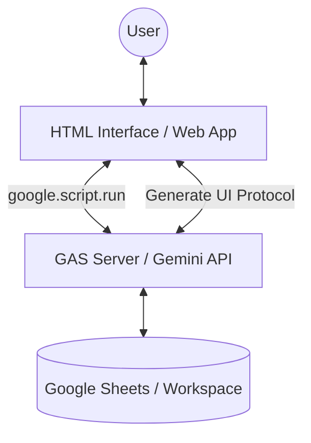

# A2UI-for-Google-Apps-Script

# Overview

**A2UI for Google Apps Script provides a seamless way to implement Google's Agent-to-User Interface (A2UI) protocol entirely within the Google Workspace ecosystem.**

By porting the official Python/TypeScript examples to Google Apps Script (GAS), this project enables developers to create dynamic, AI-generated interactive interfaces without the need for complex external server infrastructure.

# Description

Google's [A2UI (Agent-to-User Interface)](https://developers.googleblog.com/introducing-a2ui-an-open-project-for-agent-driven-interfaces/) is an open project for agent-driven interfaces, allowing AI agents to generate rich, interactive UIs that render natively across environments.

Traditionally, UI development in GAS required manual coding with `HtmlService`. By integrating A2UI, the AI can now dynamically generate the optimal buttons, forms, and charts based on the conversation context. This project offers:

- **Serverless Architecture**: Both client and server run on GAS Web Apps.
- **Deep Integration**: Direct access to Google Sheets, Docs, and other Workspace tools.
- **Lower Development Cost**: Dynamic UI generation reduces the need for manual HTML/JS maintenance.

# Workflow

To optimize performance within the GAS environment, this implementation utilizes `google.script.run` for direct communication between the UI and the AI agent, reducing the overhead of standard A2A (Agent-to-Agent) HTTP requests.

[Detailed workflow using Mermaid Chart Playground](https://mermaidchart.com/play?utm_source=mermaid_live_editor&utm_medium=share#pako:eNqtVV1v2jAU_SuWH6ZMSxmU0oEfKlG6dlT0Y4W-TJGQm1zAamKn_tjoEP991ySw9IONSuUFOznn3HPv9Y0XNFYJUEYNPDiQMZwIPtU8iyTBX861FbHIubTk1oB--bSXCsA_btar4NvoYvD5fPjxJXYI-idojy1XwVn3NdwZZEIKjytX3es-CQaDC8QW6EtlgSgv4V2FJY6R6xk3QBoMA3Adz8gHMhDGC0rQ3ApV0j1p7-iocMxIX-bOku8O9CMy8Gl8jwIyKcAFCuGFaUZyrWIwxovc-KIZGzx4bplJAUP82pR33-NpSoJrrbLckk9kpFRqSnwB26sEmDgZe7OexMgU7FhjEO40FscEqYpDEjthhITnIdcKMIfYWTgDe1NhbjPoc11ZIoh2KfbwL4uccMu3Oh3B3KfT3b_tk_Ph1SV2ydd7BFmecvvMXqXiN2Cdlj5crqSBZ4X2lfUYmWCDK1a89m4nYJ-RqxwkOVbqXsgpOVU6e7X1RbMj6oGo-Suiuzc9oidfR93-YDj2qTOyqNVqy4juegzeUNRqGu9a3Kf12aWyTTwu7i4TdsPFiVFyInS2fcBOBaYt_JSZzYBFtNRBn5hCQX5T9f2OmJWIhYTcFX6wCbv34I2jWAQbl5ECrqfmPxNY5Hj8D8L2IYxopTQkRr8pYKKb7HY5OdXWvOvJeSLc4zqhIZ1qkVBmtYOQZoAv_ZYuvExE7QwyiCjDZcL1vW_1Ejn4wf-hVLamaeWmM8omPDW4c3mCdssbaQNZGegpJy1lnZUCZQs6p6zZaNUO2wedTrvRrNc7jWZIHyk77NTaXw46hwf1erPVbjWay5D-XoWs44tWSCERVumL4hpc3YbLP_J9V2U)

# Usage

### 1. Get Gemini API Key

You will need a Gemini API Key. You can obtain one from [Google AI Studio](https://ai.google.dev/gemini-api/docs/api-key).

### 2. Copy the Sample Spreadsheet

Choose a sample and click the link to copy the Google Spreadsheet (including the script).

- **Sample 1: Restaurant Finder (Official Port)**  
  [**Copy Spreadsheet**](https://docs.google.com/spreadsheets/d/1csYUJO8LzcEFPkt_ickIkdsGZsvim6lb1OEQZHUkB3c/copy)
- **Sample 2: Budget Simulator (Workspace Integration)**  
  [**Copy Spreadsheet**](https://docs.google.com/spreadsheets/d/1HEfmSD9WMqQfy39aEZEjz7ggFeiZIx0_b2oKkrReEpk/copy)

### 3. Setup Script

1. Open the Spreadsheet and go to **Extensions** > **Apps Script**.
2. In `main.gs`, find the `apiKey` variable and paste your API key.
3. (Optional) Check the [GitHub Repository](https://github.com/tanaikech/A2UI-for-Google-Apps-Script) for the latest source code.

### 4. Deploy as Web App

1. Click **Deploy** > **New deployment**.
2. Select **Web App**.
3. Set **Execute as** to `Me`.
4. Set **Who has access** to `Only myself`.
5. Click **Deploy** and copy the **Web App URL**.

---

# Samples

## Sample 1: Restaurant Finder

This sample reproduces the official A2UI "Restaurant finder and table reservation agent".

- **Action**: Enter "Find 3 Chinese restaurants in New York".
- **Interaction**: The AI returns list cards. Clicking "Book Now" dynamically generates a reservation form.
- **GAS Advantage**: You can easily swap the hard-coded data with a `SpreadsheetApp` call to manage your own restaurant database.

| Initial View          | Search Result         | Reservation Form      |
| :-------------------- | :-------------------- | :-------------------- |
|  |  |  |

## Sample 2: Budget Simulator

A practical business automation sample that calculates a household budget and updates a Google Sheet.

- **Action**: Ask "Check this month's budget".
- **Interaction**: The AI reads data from the sheet, generates a pie chart (A2UI), and offers a simulation.
- **Automation**: Clicking "Update sheet" executes a GAS function to append new budget data directly to the spreadsheet.

| Budget Visualization  | Simulation Result     | Data Updated          |
| :-------------------- | :-------------------- | :-------------------- |
|  |  |  |

---

# Summary

- **Dynamic UI**: A2UI enables AI agents to render interactive components (buttons, charts, forms) on the fly.
- **GAS-Native**: Leverages `google.script.run` for efficient, serverless client-server communication.
- **Workspace Synergy**: Seamlessly bridges the gap between AI-driven interaction and Google Sheets data management.

# References

- [A2UI: An open project for agent-driven interfaces](https://developers.googleblog.com/introducing-a2ui-an-open-project-for-agent-driven-interfaces/)
- [Official A2UI Repository](https://github.com/google/A2UI)
- [Taking advantage of Web Apps with Google Apps Script](https://github.com/tanaikech/taking-advantage-of-Web-Apps-with-google-apps-script)

---

[Top](#top)
