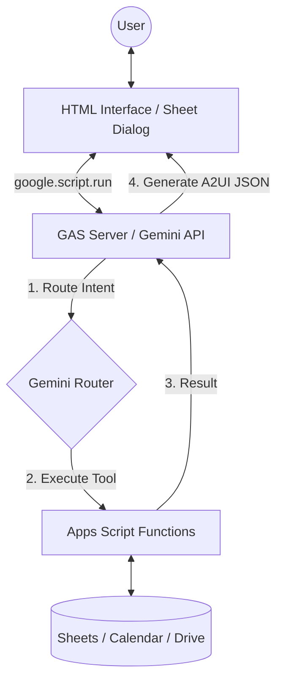

# A2UI-for-Google-Apps-Script

# Overview

**Bringing A2UI to Google Workspace with Gemini**

This repository demonstrates how to implement Google's [A2UI (Agent-to-User Interface)](https://developers.googleblog.com/introducing-a2ui-an-open-project-for-agent-driven-interfaces/) protocol entirely within the Google Apps Script (GAS) ecosystem.

By porting the official concepts to GAS, this project enables developers to create dynamic, AI-generated interactive interfaces—such as booking forms, event lists, and charts—that run natively in **Google Sheets Dialogs** and **Web Apps** without complex external server infrastructure.

# Description

A2UI is a "secure-by-design" protocol that allows AI agents to generate rich user interfaces using a strict schema rather than arbitrary code. This project leverages the Gemini API to orchestrate these interfaces within Google Workspace.

**Key Features:**

- **Serverless Architecture**: Runs entirely on Google Apps Script (GAS).
- **Workspace Integration**: Interacts directly with Google Sheets, Calendar, and Drive.
- **Hybrid Interface**: Supports both standalone Web Apps and native Spreadsheet Dialogs.
- **Gemini Routing**: Uses LLM-based routing to select appropriate tools and generate A2UI JSON payloads.

# Workflow

The implementation follows a highly optimized lifecycle to ensure a smooth, agent-driven user experience within Google Sheets or Web Apps.

1. **User Input**: The user interacts with an HTML interface (Dialog or Web App).
2. **Request**: `google.script.run` securely bridges the client and the GAS backend.
3. **Routing**: Gemini acts as a router to decide which tool (e.g., Restaurant Finder, Event Manager) to execute.
4. **Execution & Generation**: GAS executes the tool, and Gemini generates A2UI JSON based on the results.
5. **Rendering**: The client parses the JSON and renders native UI components.

# Usage

### 1. Get Gemini API Key

Obtain a valid API key from [Google AI Studio](https://ai.google.dev/gemini-api/docs/api-key).

### 2. Copy a Sample Project

Select a sample below and copy the Google Spreadsheet to your Drive.

| Sample                       | Type       | Description                                            | Link                                                                                                 |
| :--------------------------- | :--------- | :----------------------------------------------------- | :--------------------------------------------------------------------------------------------------- |
| **1. Restaurant Finder**     | Web App    | Official A2UI port. Search & Book restaurants.         | [Copy](https://docs.google.com/spreadsheets/d/1csYUJO8LzcEFPkt_ickIkdsGZsvim6lb1OEQZHUkB3c/copy)     |
| **2. Budget Simulator**      | Web App    | Charts & Sheet updates.                                | [Copy](https://docs.google.com/spreadsheets/d/1HEfmSD9WMqQfy39aEZEjz7ggFeiZIx0_b2oKkrReEpk/copy)     |
| **3. A2UI on Google Sheets** | **Dialog** | **New!** Integrated Sidebar/Dialog with Calendar sync. | [**Copy**](https://docs.google.com/spreadsheets/d/1NdgN5e2l7-CTw-NTaP50Ta75l8Zbr93ATMyUOlZk1BY/copy) |

### 3. Setup Script

1. Open the copied Spreadsheet.
2. Go to **Extensions** > **Apps Script**.
3. Open `main.gs` and set your API Key to `const apiKey = "###";`.
4. Save the script.

### 4. Run (For Sample 3)

1. Reload the Spreadsheet.
2. Click the custom menu **"sample"** > **"run"**.
3. A dialog will open. Enter a prompt (e.g., _"Show me events for Jan 17-20"_).

---

# Sample Details

## Sample 1: Restaurant Finder (Web App)

This sample reproduces the official A2UI "Restaurant finder" agent as a standalone Web App.

- **Action**: Enter "Find 3 Chinese restaurants in New York".
- **Interaction**: The AI returns list cards. Clicking "Book Now" dynamically generates a reservation form.

| Initial View          | Search Result         | Reservation Form      |
| :-------------------- | :-------------------- | :-------------------- |
|  |  |  |

## Sample 2: Budget Simulator (Web App)

A practical business automation sample that calculates a household budget and updates a Google Sheet.

- **Action**: Ask "Check this month's budget".
- **Interaction**: The AI reads data from the sheet, generates a pie chart (A2UI), and offers a simulation.

| Budget Visualization  | Simulation Result     | Data Updated          |
| :-------------------- | :-------------------- | :-------------------- |
|  |  |  |

## Sample 3: A2UI on Google Sheets (New)

This sample demonstrates "Bringing A2UI to Google Workspace". It runs inside a modal dialog within Google Sheets and interacts with local data and Google Calendar.

**Demonstration Video (YouTube):**

**Supported Prompts:**

1. **Restaurant Booking**:
   - _"Find 3 Chinese restaurants in New York"_
   - The agent finds restaurants (mock data) and provides a booking form.
2. **Event Management**:
   - _"Show me events for Jan 17-20"_
   - The agent searches the "data" sheet for events, displays them in a checkbox list, and allows you to **add selected events to your Google Calendar**.

**Source Code:** [sample/A2UI-Google-Sheets](https://github.com/tanaikech/A2UI-for-Google-Apps-Script/tree/master/samples/A2UI-Google-Sheets)

---

# Summary

- **Dynamic UI**: A2UI enables AI agents to render interactive components (buttons, charts, forms) on the fly.
- **GAS-Native**: Leverages `google.script.run` for efficient, serverless client-server communication.
- **Workspace Synergy**: Seamlessly bridges the gap between AI-driven interaction and Google Sheets data management.

# References

- [A2UI: An open project for agent-driven interfaces](https://developers.googleblog.com/introducing-a2ui-an-open-project-for-agent-driven-interfaces/)
- [Official A2UI Repository](https://github.com/google/A2UI)
- [Taking advantage of Web Apps with Google Apps Script](https://github.com/tanaikech/taking-advantage-of-Web-Apps-with-google-apps-script)
- [Article: Bringing A2UI to Google Workspace with Gemini](https://medium.com/google-cloud/a2ui-for-google-apps-script-bcd0f37a3774) (Sample 1 & 2 Ref)

---

## Licence

[MIT](LICENCE)

## Author

[Tanaike](https://tanaikech.github.io/about/)

[Donate](https://tanaikech.github.io/donate/)

## Update History

- v1.0.0 (January 8, 2026)
  - Initial release.

- v1.0.1 (January 19, 2026)
  - Added a sample 3 "A2UI on Google Sheets".

[TOP](#top)
