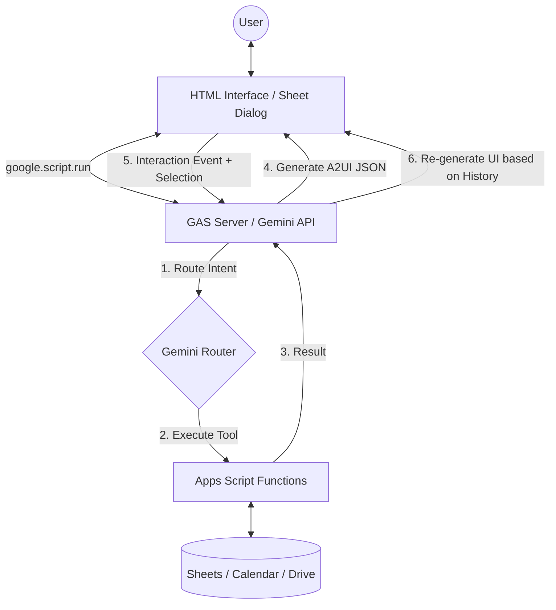

# A2UI-for-Google-Apps-Script

# Overview

**Bringing A2UI to Google Workspace with Gemini**

This repository demonstrates how to implement Google's [A2UI (Agent-to-User Interface)](https://developers.googleblog.com/introducing-a2ui-an-open-project-for-agent-driven-interfaces/) protocol entirely within the Google Apps Script (GAS) ecosystem.

By porting the official concepts to GAS, this project enables developers to create dynamic, AI-generated interactive interfaces—such as booking forms, live editors, and metadata viewers—that run natively in **Google Sheets Dialogs** and **Web Apps** without complex external server infrastructure.

# Description

A2UI is a "secure-by-design" protocol that allows AI agents to generate rich user interfaces using a strict schema rather than arbitrary code. This project leverages the Gemini API to orchestrate these interfaces within Google Workspace, focusing on **Task-Driven UIs** where the interface adapts to the user's progress.

**Key Features:**

- **Serverless Architecture**: Runs entirely on Google Apps Script (GAS).
- **Workspace Integration**: Interacts directly with Google Sheets, Calendar, and Drive.
- **Recursive UI Loop (Sample 4)**: A stateful workflow where Gemini evaluates previous interactions to generate the next appropriate UI (e.g., Select File -> OK -> Open Editor).
- **Feedback-Loop Architecture (Sample 5)**: Uses Google Sheets as a persistent memory store to track user performance and adaptively adjust content difficulty.
- **Gemini Routing**: Uses LLM-based routing to select appropriate tools and generate A2UI JSON payloads.

# Workflow

The implementation follows a stateful, agent-driven lifecycle. The backend uses the conversation history to decide which functional UI to build next.

1. **User Input**: The user interacts with an HTML interface.
2. **Request**: `google.script.run` securely bridges the client and the GAS backend.
3. **Reasoning**: Gemini acts as a router to decide which tool to execute and generates an initial UI (e.g., a File Selector).
4. **Recursive Interaction**: When the user performs an action (like clicking "OK"), the client sends a **System Event** back to GAS.
5. **Stateful Generation**: Gemini evaluates the **original prompt** + **new selection** from the history to generate the final functional interface (e.g., a dynamic Text Editor).

# Usage

### 1. Get Gemini API Key

Obtain a valid API key from [Google AI Studio](https://ai.google.dev/gemini-api/docs/api-key).

### 2. Copy a Sample Project

Select a sample below and copy the Google Spreadsheet to your Drive.

| Sample                   | Type        | Description                                               | Link                                                                                             |
| :----------------------- | :---------- | :-------------------------------------------------------- | :----------------------------------------------------------------------------------------------- |
| **1. Restaurant Finder** | Web App     | Official A2UI port. Search & Book restaurants.            | [Copy](https://docs.google.com/spreadsheets/d/1csYUJO8LzcEFPkt_ickIkdsGZsvim6lb1OEQZHUkB3c/copy) |
| **2. Budget Simulator**  | Web App     | Charts & Sheet updates.                                   | [Copy](https://docs.google.com/spreadsheets/d/1HEfmSD9WMqQfy39aEZEjz7ggFeiZIx0_b2oKkrReEpk/copy) |
| **3. Workspace Sync**    | **Dialog**  | Integrated Sidebar/Dialog with Calendar sync.             | [Copy](https://docs.google.com/spreadsheets/d/1NdgN5e2l7-CTw-NTaP50Ta75l8Zbr93ATMyUOlZk1BY/copy) |
| **4. Drive Task Agent**  | **Dialog**  | **Recursive Loop!** Dynamic file metadata/content editor. | [Copy](https://docs.google.com/spreadsheets/d/1UB5j-ySSBBsGJjSaKWpBPRYkokl7UtgYhDxqmYW00Vc/copy) |
| **5. Adaptive Learning** | **Sidebar** | **Feedback Loop!** Persistent memory & adaptive quizzes.  | [Copy](https://docs.google.com/spreadsheets/d/1eckORqs3JtTIJZTB0I5VpqduZw9g3-mM764s4neG7Fo/copy) |

### 3. Setup Script

1. Open the copied Spreadsheet.
2. Go to **Extensions** > **Apps Script**.
3. Open `main.gs` (or `Code.gs`) and set your API Key to `const apiKey = "###";`.
4. Save the script.

### 4. Run (For Dialog/Sidebar Samples 3, 4 & 5)

1. Reload the Spreadsheet.
2. Click the custom menu **"sample"** > **"run"** (or **"Start Learning"**).
3. A dialog or sidebar will open. Enter your request.

---

# Sample Details

## Sample 1: Restaurant Finder (Web App)

This sample reproduces the official A2UI "Restaurant finder" agent as a standalone Web App.

- **Action**: Enter "Find 3 Chinese restaurants in New York".
- **Interaction**: The AI returns list cards. Clicking "Book Now" dynamically generates a reservation form.

| Initial View          | Search Result         | Reservation Form      |
| :-------------------- | :-------------------- | :-------------------- |
|  |  |  |

## Sample 2: Budget Simulator (Web App)

A practical business automation sample that calculates a household budget and updates a Google Sheet.

- **Action**: Ask "Check this month's budget".
- **Interaction**: The AI reads data from the sheet, generates a pie chart (A2UI), and offers a simulation.

| Budget Visualization  | Simulation Result     | Data Updated          |
| :-------------------- | :-------------------- | :-------------------- |
|  |  |  |

## Sample 3: Workspace Sync (Dialog)

This sample demonstrates "Bringing A2UI to Google Workspace". It runs inside a modal dialog within Google Sheets and interacts with local data and Google Calendar.

**Demonstration Video (YouTube):**

**Supported Prompts:**

1. **Restaurant Booking**:
   - _"Find 3 Chinese restaurants in New York"_
   - The agent finds restaurants (mock data) and provides a booking form.
2. **Event Management**:
   - _"Show me events for Jan 17-20"_
   - The agent searches the "data" sheet for events, displays them in a checkbox list, and allows you to **add selected events to your Google Calendar**.

**Source Code:** [sample/A2UI-Google-Sheets](https://github.com/tanaikech/A2UI-for-Google-Apps-Script/tree/master/samples/A2UI-Google-Sheets)

---

## Sample 4: Drive Task Agent (Recursive UI Loop)

This sample demonstrates **Recursive UI Generation**. The agent builds the tool you need based on the conversation history and your interactions.

**Demonstration Video (YouTube):**

[Mermaid Chart Playground](https://mermaid.ai/play?utm_source=mermaid_live_editor&utm_medium=share#pako:eNqVU12P2jAQ_CsrP1EVKCmfzcNJLRfa9CicCFzVCgm5yRIsEpvaDoUi_ns3CaBrr6hXPyS2d2dmd2wfWKgiZC4z-D1DGeKt4LHm6VwCjQ3XVoRiw6WFmUH9dHeglbQoI6gIGeGuvrJp8uJp2jserouslAtZj81fUt5jKqSAytt7n6JlPNes3dycRVzw6K8N3GuVbixUsB7XYc58-JEzWAUYCQscliLBOTuJnNFEdCrDhY1WIRqT80_yxo2tlJxV-CCMVXp_Ap8QhC3rc2GC3CgpZAwvYapUAn2eJGVymVJ7LDTzFx-D8QgqA3_oLQJv6PWn48kf5L-1OKEvauivMFx_UzsYUj1X3AgwwdAaGFC7hsrpJyJcGzJkfDdnJWakLILaEuEZVoVzJ8GXYOp9WngP3mh6JhNKEtFYi1hITr3lmJ39LyODvbGYeluUz3KzhlueZJzK9HN2S_KXUv5tq3frk5_wCh5877P3HGOn3KxrwQZDsRRhcYJX3L24OdtEVN6cgZDg0QVT-rofWZG7yC_gIlRlQ2FxQViVxVpEzLU6wypLUdNboCU75GxzZleYkohL0wiXPEtsfoZHgtHz-KpUekZqlcUr5i55YmhVCp5e7SWlaLWvMmmZ220XFMw9sB1zHadV7_RavV6z02p2mt0GRfe0_bpZ73XbDcdpOM1213F6xyr7Wag2KNB683gcfwFCXmAp)

**Supported Prompts:**
Replace `'sample'` with the actual folder name in your Google Drive.

1. **View Content**: _"List files in 'sample' and show their content."_
2. **View Metadata**: _"Show me metadata for files in 'sample'."_
3. **Verify and Edit**: _"I want to edit a file in 'sample'. Show me the files first."_

**Key Mechanics:**

- **The "OK" Button**: Clicking OK sends a System Event with selected file IDs. Gemini analyzes the **original intent** to decide whether to render a Viewer, Metadata card, or an Editor.
- **Dynamic Editor**: Supports real-time text file updates (e.g., .txt, .json, .html).

**Source Code:** [sample/Drive-Task-Agent](https://github.com/tanaikech/A2UI-for-Google-Apps-Script/tree/master/samples/A2UI-Drive-Task-Agent)

---

## Sample 5: Adaptive Learning Agent (AI Tutor)

This sample demonstrates a **Feedback-Loop Architecture** utilizing Google Sheets as a persistent memory store. The agent generates personalized quizzes, tracks performance, and dynamically adjusts difficulty based on historical data.

**Demonstration Video (YouTube):**

[Mermaid Chart Playground](https://mermaid.ai/play?utm_source=mermaid_live_editor&utm_medium=share#pako:eNqFVVtP4zgU_itHfkBFG7K0pVyiFVKHalj2wiztzq606oubnKYWiZ2xHZiC-O_7OUkLw7UPVROf23c57r1ITcYiEY6_1axTniiZW1nONeEja290XS7Yds-pN5a-us1zJa1Xqaqk9vTZGu1ZZyQdjQdfL6g3UxkvpN19GftJptdd6LkxecE0ripHs9Sqyr8M_5NLY9dPomcrZu-oN_n0WnErlW6CuVRaUe-cNVvp1Q3aXCChTbk0nsnccIsnatMS6sdoIgua8BLJXhlNO3QWoH33NGVvFd_Ioi0REvdOTzfIE_pSsaYONtIudFWHJDDr_C8L-_Npj-M8jmguzixL9Jf0rVZ3JBcGgefjGS2kU6mbiw7XpjS6dJwlNAvMhdb0lzXlhq_uGIEtW4hLpQ6KBdyuQr_MBdpoCQlXykHJ9RMmrMpXnsySNulnK06vHZh1nq52xhG5Ok3ZOQKV7KIGjsQkruJULVVK3lT4vmV5rRHGLm6rt_X2niIAjbXVHQa2GKiUsN6G5g8UGkChR0X_MDm67tBkrWWJX1N0YKt0_pyWLvs5e_QT_dqQoVKovp2gyQ0Zrw0-87ZO8Ysz-m325bJV9m9pc_Z4dRXUhm8cSmMNztDFaNbe7f440g_OacZq1mbKDvGOnxkA0WHq5CXQINoVXNSOMZWZMrSoPTbXRRS2mxaFgZQRsU_jj_w_jGFbD3bTzvsQyIGgcDe84foZF5xiHaV2twimrckbv8VgZSp1zr3d921dL0rladwWeUO9f2ShsmZxul47SJDF-o6pejTSB_KB4brwQR4IiWLBQE0V4HxrmWAz0nxLaC6pt5E46saNupq77y3UXGyp3F5pMxiP56KRrq4CMtfsp18x2uHGKYyp4g8kO4jpM3O2wNDg4xHTZSgw81y5d4zXcbLBTxMAfMt6reVaINul3TInkOtWCyNt9hoNjy0nylWFXLukgY0Ld5ymNQy3pikmb15ix3_nQI9lnfuVo4sMrOGa4aw5h0v_7S4aGofLxpU4b47AxqzOcwiEXZyLJyQIEpHIrcpEggXmSJQMDOFR3IeJ5wK0l5AjaJXxUkLRuZjrB6Thn-U_Y8pNpjV1vhLJUhYOT61y3T_n9q1t2DoztfYi6feP95sqIrkX30VychCPRsPjwdHB0Wh41D8aRmItkr3-_mHcPxkMRif9EQ6HD5G4a9ruxyeHR8Pjg_5wNBwN-ocnBw__A62jlR0)

**Supported Prompts:**

1.  **Adaptive Learning:** _"Create a quiz about Google Apps Script basics."_
    - Generates targeted questions.
    - Analyzes answers and logs results to Sheets.
    - Provides a "Performance Analysis" dashboard with next steps.
2.  **Versatility Verification:** _"Find 3 Chinese restaurants in New York"_
    - Demonstrates that the same architecture handles complex transactional flows (booking forms) alongside educational logic.

**Key Mechanics:**

- **Goal Definition & Context Retrieval:** Scans the active Spreadsheet for past performance data before generating content.
- **Immediate Feedback:** Validates answers in real-time and updates the "Memory" (Google Sheets).
- **Strategic Analysis:** Gemini provides qualitative feedback (Strengths/Weaknesses) rather than just scores.

---

# Summary

- **Recursive Logic**: AI can manage multi-step workflows by generating specialized interfaces on the fly.
- **Dynamic UI**: A2UI enables AI agents to render interactive components (buttons, charts, forms, editors) based on context.
- **GAS-Native**: Leverages `google.script.run` for efficient, serverless client-server communication.
- **Workspace Synergy**: Seamlessly bridges the gap between AI reasoning and Google Workspace data management.

# References

- [A2UI: An open project for agent-driven interfaces](https://developers.googleblog.com/introducing-a2ui-an-open-project-for-agent-driven-interfaces/)
- [Official A2UI Repository](https://github.com/google/A2UI)
- [Article: A2UI for Google Apps Script](https://medium.com/google-cloud/a2ui-for-google-apps-script-bcd0f37a3774)
- [Article: Bringing A2UI to Google Workspace with Gemini](https://medium.com/google-cloud/bringing-a2ui-to-google-workspace-with-gemini-0d85026969b8)
- [Article: Beyond Chatbots: Building Task-Driven Agentic Interfaces in Google Workspace with A2UI and Gemini](https://medium.com/google-cloud/beyond-chatbots-building-task-driven-agentic-interfaces-in-google-workspace-with-a2ui-and-gemini-06998dcf16d2)

---

## Licence

[MIT](LICENCE)

## Author

[Tanaike](https://tanaikech.github.io/about/)

[TOP](#top)

---

## Update History

- v1.0.0 (January 8, 2026)
  - Initial release.

- v1.0.1 (January 19, 2026)
  - Added a sample 3 "Workspace Sync".

- v1.0.2 (February 3, 2026)
  - Added a sample 4 "Drive Task Agent" with recursive UI generation logic.

- v1.0.3 (February 7, 2026)
  - Added a sample 5 "Adaptive Learning Agent" with feedback-loop architecture.
